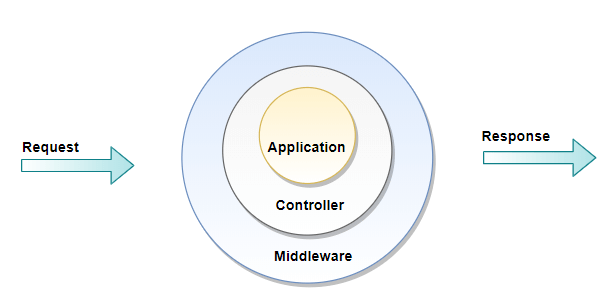

# laravel-interview-questions


1. ### What are the main features of Laravel?

    Some of the main features of Laravel are:

   * Eloquent ORM
   * Query builder
   * Reverse Routing
   * Restful Controllers
   * Migrations
   * Database Seeding
   * Unit Testing
   * Homestead

2. ### What do you understand by Eloquent ORM?
   **Eloquent ORM (Object-Relational Mapping)** is one of the main features of the Laravel framework. It may be defined as an advanced PHP implementation of the active record pattern.

    *Active record pattern is an architectural pattern which is found in software. It is responsible for keeping in-memory object data in relational databases*

    Eloquent ORM is also responsible for providing the internal methods at the same time when enforcing constraints on the relationship between database objects. Eloquent ORM represents database tables as classes, with their object instances tied to single table rows, while following the active record pattern.

3. ### What is Query Builder in Laravel?
   Laravel's Query Builder provides more direct access to the database, alternative to the Eloquent ORM. It doesn't require SQL queries to be written directly. Instead, it offers a set of classes and methods which are capable of building queries programmatically. It also allows specific caching of the results of the executed queries.

4. ### Write down the name of some aggregates methods provided by the Laravel's query builder.

    Some of the methods that Query Builder provides are:

    * count()
    * max()
    * min()
    * avg()
    * sum()

5. ### What is routing?

    All Laravel routes are defined in route files, which are stored in the routes directory. These files are loaded by the MVC framework. The routes/web.php files define routes that are available for the web interface. Those routes are allotted as the web middleware group, which provide features such as **session state** and **CSRF** protection. The routes available in **routes/api.php** are stateless and are allotted as the API middleware group. For most of the applications, one should start by defining routes in routes/web.php file.

6. ### What do you understand by Reverse routing?

    Reverse routing in Laravel is used to generate the URL based on name or symbol. It defines a relationship between the links and, Laravel routes, and it is possible to make later changes to the routes to be automatically propagated into relevant links. When the links are generated using names of existing routes, the appropriate uniform resource identifiers (URIs) are automatically generated by Laravel. Reverse routing provides flexibility to the application and helps the developer to write cleaner codes.

    Route Declaration:
    
    ```
    Route::get('login', 'users@login');  
    Route::get('login', 'users@login');  
    ```
    A link can be created to it using reverse routing, which can be further transferred in any parameter that we have defined. If optional parameters are not supplied, they are removed automatically from the generated links

    ```
    {{ HTML::link_to_action('users@login') }}  
    {{ HTML::link_to_action('users@login') }}  
    ```
    By using it, a URL like https://abc.go.com/loginwill be created automatically.

7. ### How will you describe Bundles in Laravel?

    In Laravel, Bundles are also known as **Packages**. Packages are the primary way to add more functionality to Laravel. Packages can be anything, from a great way to work with dates like Carbon, or an entire BDD testing framework like **Behat**. Laravel also provides support for creating custom packages.

    There are different types of packages. Some of them are stand-alone packages. This means they can work with any PHP framework. The frameworks like **Carbon and Behat** are examples of stand-alone packages. Other packages are intended for use with Laravel. These packages may contain routes, controllers, views, and configurations which are mainly designed to enhance a Laravel application.
8. ###  What is a composer, and how can we install Laravel by the composer?

    A composer is a dependency manager in PHP. It manages the dependencies which are required for a project. It means that the composer will pull in all the necessary libraries, dependencies, and manage all at a single place.

    ```
    composer create-project laravel/laravel example-app 

    cd example-app   

    php artisan serve
    ```
9. ###  Does Laravel support caching?
    Yes, Laravel provides support for popular caching backends like **Memcached** and **Redis**.

    By default, Laravel is configured to use file cache driver, which is used to store the serialized or cached objects in the file system. For huge projects, it is suggested to use **Memcached** or **Redis**.

10. ### How to clear cache in Laravel?

    The syntax to clear cache in Laravel is given below:

    * php artisan cache: clear
    * php artisan config: clear
    * php artisan cache: clear
  

11. ### How will you explain middleware in Laravel?
    As the name suggests, middleware works as a middleman between request and response. Middleware is a form of HTTP requests filtering mechanism. For example, Laravel consists of middleware which verifies whether the user of the application is authenticated or not. If a user is authenticated and trying to access the dashboard then, the middleware will redirect that user to home page; otherwise, a user will be redirected to the login page.

    There are two types of middleware available in Laravel:

    **Global Middleware**

    It will run on every HTTP request of the application.

    **Route Middleware**

    It will be assigned to a specific route.

    **Syntax**
    ```
    php artisan make:middlewareMiddelwareName  
    php artisan make:middlewareMiddelwareName  
    ```
    **Example**
    ```
    php artisan make:middlewareUserMiddleware  
    php artisan make:middlewareUserMiddleware  
    ```

    Now, UserMiddleware.php file will be created in app/Http/Middleware.

    
